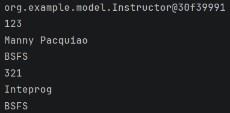
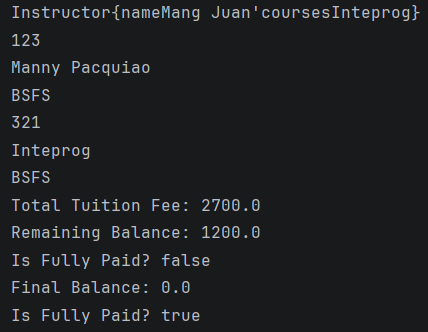

# Inheritance

* Key concept in OOP that allows a new class (subclass/child) to acquire the properties and behaviors (fields and methods) of an existing class (superclass/parent)
* Promotes code reuse and establishes an “is-a” relationship

---

---

# TuitionFeePayment.java added

---