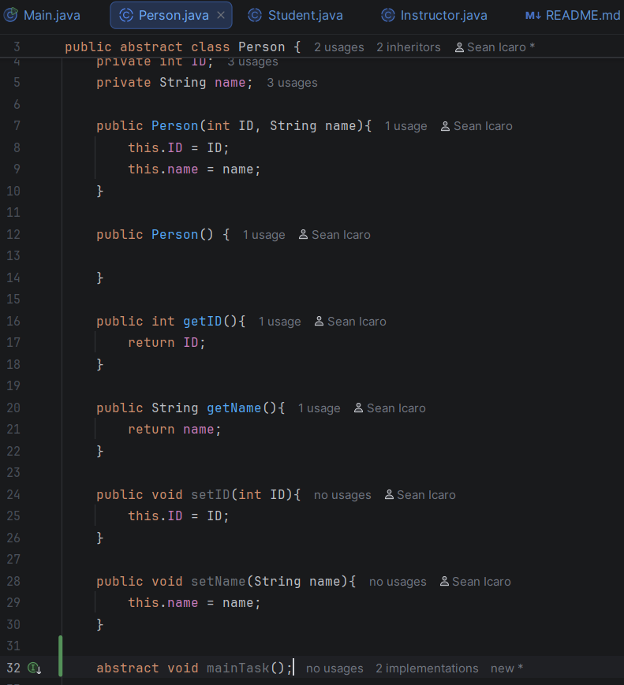
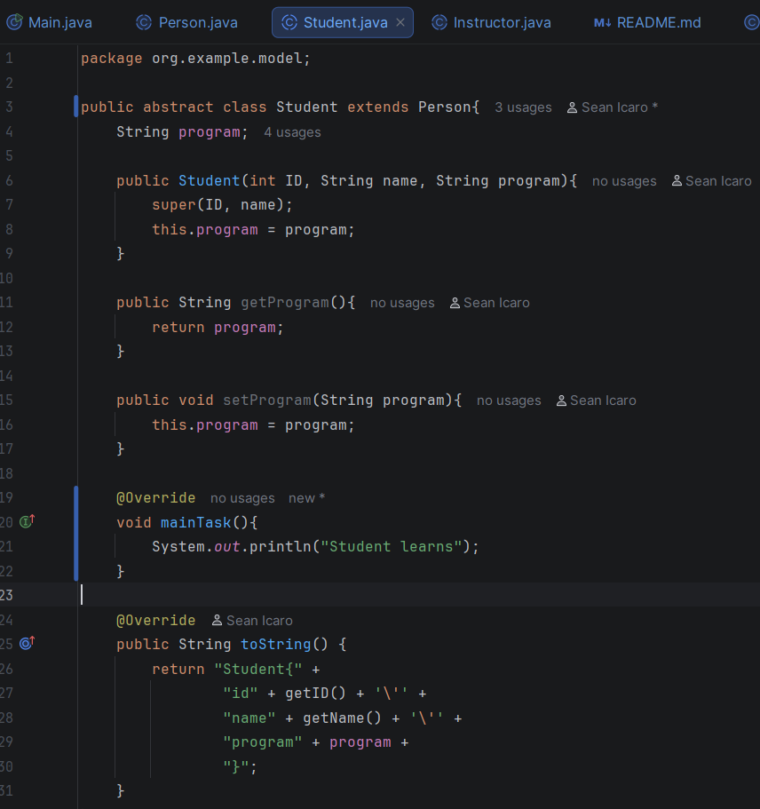
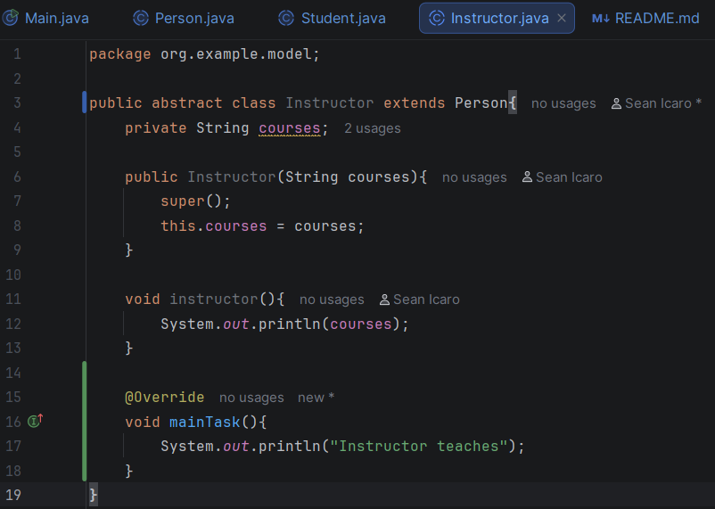

# Abstraction

---

## ABSTRACT CLASS
* class that cannot be instantiated directly
* used as a base for other classes
* can contain abstract methods (methods without a body) as well as regular methods (with an implementation)
* class declared with the “abstract” keyword

---
## 1. Person.java

---
## 2. Student.java

---
## 3. Instructor.java

---